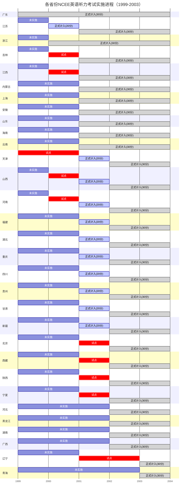

```mermaid
gantt
    title 各省份NCEE英语听力考试实施进程（1999-2003）
    dateFormat  YYYY
    axisFormat %Y
    
    section 广东
    正式计入(30分)    :done, 1999, 5y
    
    section 江苏
    未实施            :0, 1999, 1y
    正式计入(20分)    :active, 2000, 1y
    正式计入(30分)    :done, 2001, 3y
    
    section 浙江
    未实施            :0, 1999, 1y
    正式计入(30分)    :done, 2000, 4y
    
    section 吉林
    未实施            :0, 1999, 1y
    试点              :crit, 2000, 1y
    正式计入(30分)    :done, 2001, 3y
    
    section 江西
    未实施            :0, 1999, 1y
    试点              :crit, 2000, 1y
    正式计入(30分)    :done, 2001, 3y
    
    section 内蒙古
    未实施            :0, 1999, 2y
    正式计入(30分)    :done, 2001, 3y
    
    section 上海
    未实施            :0, 1999, 2y
    正式计入(30分)    :done, 2001, 3y
    
    section 安徽
    未实施            :0, 1999, 2y
    正式计入(30分)    :done, 2001, 3y
    
    section 山东
    未实施            :0, 1999, 2y
    正式计入(30分)    :done, 2001, 3y
    
    section 海南
    未实施            :0, 1999, 2y
    正式计入(30分)    :done, 2001, 3y
    
    section 云南
    未实施            :0, 1999, 2y
    正式计入(30分)    :done, 2001, 3y
    
    section 天津
    试点              :crit, 1999, 2y
    正式计入(20分)    :active, 2001, 1y
    正式计入(30分)    :done, 2002, 2y
    
    section 山西
    未实施            :0, 1999, 1y
    试点              :crit, 2000, 1y
    正式计入(20分)    :active, 2001, 1y
    正式计入(30分)    :done, 2002, 2y
    
    section 河南
    未实施            :0, 1999, 1y
    试点              :crit, 2000, 1y
    正式计入(20分)    :active, 2001, 1y
    正式计入(30分)    :done, 2002, 2y
    
    section 福建
    未实施            :0, 1999, 2y
    正式计入(20分)    :active, 2001, 1y
    正式计入(30分)    :done, 2002, 2y
    
    section 湖北
    未实施            :0, 1999, 2y
    正式计入(20分)    :active, 2001, 1y
    正式计入(30分)    :done, 2002, 2y
    
    section 重庆
    未实施            :0, 1999, 2y
    正式计入(20分)    :active, 2001, 1y
    正式计入(30分)    :done, 2002, 2y
    
    section 四川
    未实施            :0, 1999, 2y
    正式计入(20分)    :active, 2001, 1y
    正式计入(30分)    :done, 2002, 2y
    
    section 贵州
    未实施            :0, 1999, 2y
    正式计入(20分)    :active, 2001, 1y
    正式计入(30分)    :done, 2002, 2y
    
    section 甘肃
    未实施            :0, 1999, 2y
    正式计入(20分)    :active, 2001, 1y
    正式计入(30分)    :done, 2002, 2y
    
    section 新疆
    未实施            :0, 1999, 2y
    正式计入(20分)    :active, 2001, 1y
    正式计入(30分)    :done, 2002, 2y
    
    section 北京
    未实施            :0, 1999, 2y
    试点              :crit, 2001, 1y
    正式计入(30分)    :done, 2002, 2y
    
    section 西藏
    未实施            :0, 1999, 2y
    试点              :crit, 2001, 1y
    正式计入(30分)    :done, 2002, 2y
    
    section 陕西
    未实施            :0, 1999, 2y
    试点              :crit, 2001, 1y
    正式计入(30分)    :done, 2002, 2y
    
    section 宁夏
    未实施            :0, 1999, 2y
    试点              :crit, 2001, 1y
    正式计入(30分)    :done, 2002, 2y
    
    section 河北
    未实施            :0, 1999, 3y
    正式计入(30分)    :done, 2002, 2y
    
    section 黑龙江
    未实施            :0, 1999, 3y
    正式计入(30分)    :done, 2002, 2y
    
    section 湖南
    未实施            :0, 1999, 3y
    正式计入(30分)    :done, 2002, 2y
    
    section 广西
    未实施            :0, 1999, 3y
    正式计入(30分)    :done, 2002, 2y
    
    section 辽宁
    未实施            :0, 1999, 2y
    试点              :crit, 2001, 2y
    正式计入(30分)    :done, 2003, 1y
    
    section 青海
    未实施            :0, 1999, 4y
    正式计入(30分)    :done, 2003, 1y
```